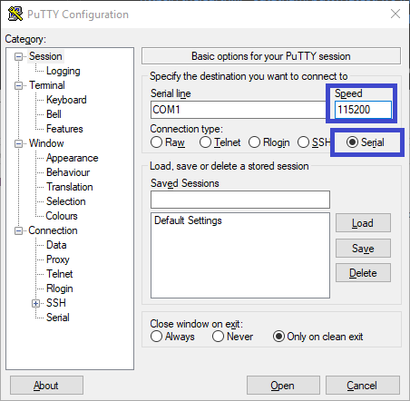
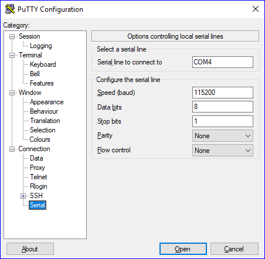
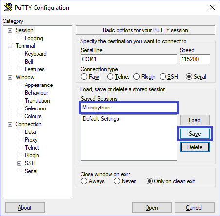
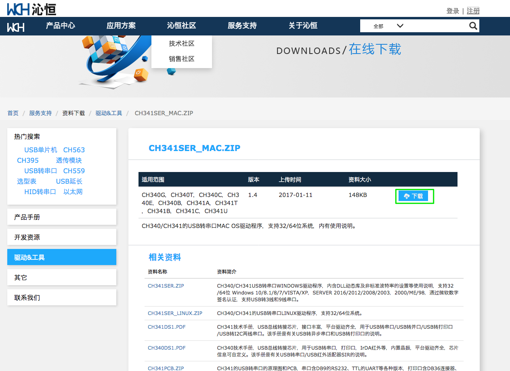

# Instrukcja instalacji

**UWAGA**

Jeśli istnieje możliwość instalacji programu w wersji 32-bit lub 64-bit należy wybrać odpowiednią dla swojego systemu operacyjnego.

## Windows
### Instalacja terminala szeregowego.

1. Ściągnij program PuTTy ze strony:

https://the.earth.li/~sgtatham/putty/latest/w64/putty.exe (wersja 64-bit)

https://the.earth.li/~sgtatham/putty/latest/w32/putty.exe (wersja 32-bit)

2. Skopiuj program do znanej lokalizacji. 

_Program nie wymaga instalacji, uruchamia się go poprzez podwójne kliknięcie na ikonie._

3. Skonfiguruj program PuTTy do połączenia szeregowego.
    - Ustaw szybkość połączenia na _115200 kbps_.
    - Ustaw typ połączenia na _Serial_.

    

    - Wybierz kategorię _Connection>Serial_ z drzewa po lewej stronie okna.
    - Ustaw parametry połączenia szeregowego:
        - Speed: 115200
        - Data bits: 8
        - Stop bits: 1
        - Parity: None
        - Flow control: None

    

    - Zapisz sesję jako _Micropython_
        - Wpisz nazwę sesji - _Micropython_ w pole tekstowe
        - Kliknij przycisk _Save_

    

### Instalacja narzędzia ampy
1. Otwórz wiersz poleceń systemu Windows.
2. Zainstaluj pakiet `adafruit-ampy` przy pomocy narzędzia `pip`:

```
python -m pip install adafruit-ampy
```

## Mac
Instrukcja instalacji została opracowana na systemie operacyjnym macOS 10.13 (High Sierra).

### Wymagania wstępne

- Komputer Mac z systemem macOS 10.13 High Sierra.
- Zainstalowany manager pakietów Homebrew (https://brew.sh/)

### Instalacja sterowników układu Winchip CH340

Układ Winchip CH340 jest opdowiedzialny za konwersję TTL->USB, czyli odpowiada za możliwość podłączenia wyprowadzenia portu szeregowego płytki deweloperskiej do portu USB komputera.

1. Usuń poprzednie wersje sterownika:
    - Uruchom terminal i wykonaj następujące komendy
    - **Uwaga: Komendy wykonywane są z uprawnieniami administratora systemu, należy zachować ostrożność.**
    ```
    sudo su
    rm -rf /System/Library/Extensions/usbserial.kext
    rm -rf /Library/Extensions/usbserial.kext
    ```

2. Ściągnij archiwum `zip` ze sterownikiem ze strony:

    https://blog.sengotta.net/signed-mac-os-driver-for-winchiphead-ch340-serial-bridge/



3. Rozpakuj zawartość archiwum.
4. Zainstaluj sterownik z pakietu `CH34x_Install_V1.4.pkg`.
    - Konieczne będą uprawnienia administratora na komputerze.
5. Zresetuj komputer.

### Instalacja terminala szeregowego

1. Otwórz terminal.
2. Zainstaluj program `picocom` przy pomocy managera pakietów `Homebrew`:

    ```
    brew install picocom
    ```

## Instalacja narzędzia ampy
1. Otwórz terminal.
2. Zainstaluj pakiet `adafruit-ampy` przy pomocy narzędzia `pip`:

    ```
    python -m pip install adafruit-ampy
    ```

    lub

    ```
    python3 -m pip install adafruit-ampy
    ```


