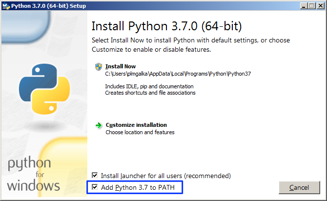
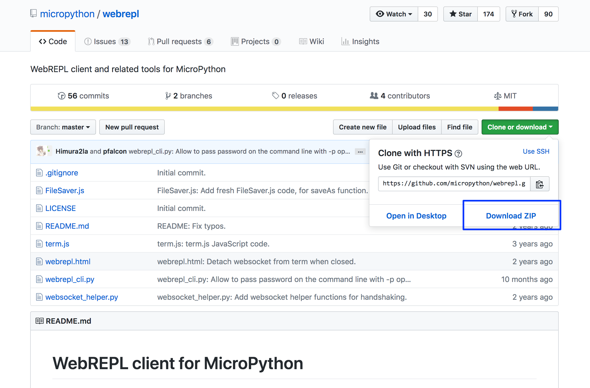

# Instrukcja instalacji

**UWAGA**

Jeśli istnieje możliwość instalacji programu w wersji 32-bit lub 64-bit należy wybrać odpowiednią dla swojego systemu operacyjnego.

## Windows

## Instalacja interpretera Python

Do uruchomienia narzędzi konieczny jest interpreter języka Python w wersji 2.7 lub 3.x. W przypadku kiedy interpreter Python jest już zainstalowany tę sekcję można pominąć.

1. Pobierz instalator języka Python ze strony:

https://www.python.org/ftp/python/3.7.0/python-3.7.0.exe (wersja 32-bit)

https://www.python.org/ftp/python/3.7.0/python-3.7.0-amd64.exe (wersja 64-bit)

2. Zainstaluj interpreter języka Python przy pomocy pobranego instalatora. 

**Należy upewnić się, aby podczas instalacji włączyć opcję  „Add Python 3.7 to PATH”.**




### Instalacja terminala szeregowego.

1. Pobierz program PuTTy ze strony:

https://the.earth.li/~sgtatham/putty/latest/w64/putty.exe (wersja 64-bit)

https://the.earth.li/~sgtatham/putty/latest/w32/putty.exe (wersja 32-bit)

2. Skopiuj program do znanej lokalizacji. 

_Program nie wymaga instalacji, uruchamia się go poprzez podwójne kliknięcie na ikonie._

3. Skonfiguruj program PuTTy do połączenia szeregowego.
    - Ustaw szybkość połączenia na _115200 kbps_.
    - Ustaw typ połączenia na _Serial_.

    

    - Wybierz kategorię _Connection>Serial_ z drzewa po lewej stronie okna.
    - Ustaw parametry połączenia szeregowego:
        - Speed: 115200
        - Data bits: 8
        - Stop bits: 1
        - Parity: None
        - Flow control: None

    

    - Zapisz sesję jako _Micropython_
        - Wpisz nazwę sesji - _Micropython_ w pole tekstowe
        - Kliknij przycisk _Save_

    

### Instalacja narzędzia ampy
1. Otwórz wiersz poleceń systemu Windows.
2. Zainstaluj pakiet `adafruit-ampy` przy pomocy narzędzia `pip`:

    ```
    python -m pip install adafruit-ampy
    ```

### Pobranie narzędzi WebREPL

Narzędzia WebREPL można pobrać w formie repozytorium git, lub za pomocą strony GitHub. Należy wybrać jedną z metod.

#### Pobranie przy pomocy git

1. Uruchom linię poleceń `git`
2. Pobierz repozytorium przy pomocy komendy:

    ```
    git clone https://github.com/micropython/webrepl.git
    ```

#### Pobranie z GitHub

1. Wejdź przy pomocy przeglądarki na stronę repozytorium WebREPL:

    https://github.com/micropython/webrepl

2. Pobierz narzędzie w formie archiwum `zip`.
    - Kliknij na przycisku `Clone or download`.
    - Wybierz opcję Download ZIP.

    

3. Rozpakuj pobrane archiwum w znanej lokalizacji na dysku.


## Mac
Instrukcja instalacji została opracowana na systemie operacyjnym macOS 10.13 (High Sierra).

### Wymagania wstępne

- Komputer Mac z systemem macOS 10.13 High Sierra.
- Zainstalowany manager pakietów Homebrew (https://brew.sh/)

### Instalacja interpretera Python

1. Otwórz aplikację `Terminal`.
2. Zainstaluj interpreter języka Python przy pomocy komendy:

    ```
    brew install python3
    ```

### Instalacja sterowników układu Winchip CH340

Układ Winchip CH340 jest opdowiedzialny za konwersję TTL->USB, czyli odpowiada za możliwość podłączenia wyprowadzenia portu szeregowego płytki deweloperskiej do portu USB komputera.

1. Usuń poprzednie wersje sterownika:
    - Uruchom terminal i wykonaj następujące komendy
    - **Uwaga: Komendy wykonywane są z uprawnieniami administratora systemu, należy zachować ostrożność.**
    ```
    sudo su
    rm -rf /System/Library/Extensions/usbserial.kext
    rm -rf /Library/Extensions/usbserial.kext
    ```

2. Pobierz archiwum `zip` ze sterownikiem ze strony:

 http://www.wch.cn/download/CH341SER_MAC_ZIP.html


3. Rozpakuj zawartość archiwum.
4. Zainstaluj sterownik z pakietu `CH34x_Install_V1.4.pkg`.
    - Konieczne będą uprawnienia administratora na komputerze.
5. Zresetuj komputer.

### Instalacja terminala szeregowego

1. Uruchom terminal.
2. Zainstaluj program `picocom` przy pomocy managera pakietów `Homebrew`:

    ```
    brew install picocom
    ```

## Instalacja narzędzia ampy
1. Otwórz terminal.
2. Zainstaluj pakiet `adafruit-ampy` przy pomocy narzędzia `pip`:

    ```
    python -m pip install adafruit-ampy
    ```

    lub

    ```
    python3 -m pip install adafruit-ampy
    ```

### Pobranie narzędzi WebREPL

Narzędzia WebREPL można pobrać w formie repozytorium git, lub za pomocą strony GitHub. Należy wybrać jedną z metod.

#### Pobranie przy pomocy git

1. Otwórz terminal.
2. Pobierz repozytorium przy pomocy komendy:

    ```
    git clone https://github.com/micropython/webrepl.git
    ```

#### Pobranie z GitHub

1. Wejdź przy pomocy przeglądarki na stronę repozytorium WebREPL:

    https://github.com/micropython/webrepl

2. Pobierz narzędzie w formie archiwum `zip`.
    - Kliknij na przycisku `Clone or download`.
    - Wybierz opcję Download ZIP.


3. Rozpakuj pobrane archiwum w znanej lokalizacji na dysku.

## Ubuntu

### Instalacja interpretera Python, terminala szeregowego oraz narzędzi git

1. Otwórz terminal.
2. Wydaj następujące komendy instalacyjne:

```
sudo apt install python3 python3-pip picocom git
```

## Instalacja narzędzia ampy
1. Otwórz terminal.
2. Zainstaluj pakiet `adafruit-ampy` przy pomocy narzędzia `pip`:

    ```
    python3 -m pip install adafruit-ampy
    ```

### Pobranie narzędzi WebREPL

Narzędzia WebREPL można pobrać w formie repozytorium git, lub za pomocą strony GitHub. Należy wybrać jedną z metod.

#### Pobranie przy pomocy git

1. Uruchom terminal.
2. Pobierz repozytorium przy pomocy komendy:

    ```
    git clone https://github.com/micropython/webrepl.git
    ```

#### Pobranie z GitHub

1. Wejdź przy pomocy przeglądarki na stronę repozytorium WebREPL:

    https://github.com/micropython/webrepl

2. Pobierz narzędzie w formie archiwum `zip`.
    - Kliknij na przycisku `Clone or download`.
    - Wybierz opcję Download ZIP.


3. Rozpakuj pobrane archiwum w znanej lokalizacji na dysku.