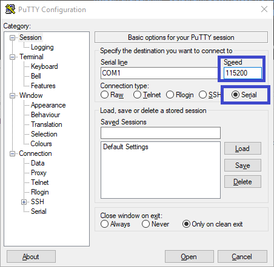
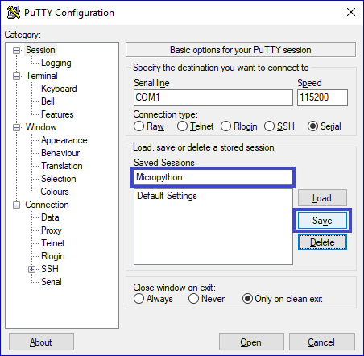

# Instrukcja instalacji

**UWAGA**

Jeśli istnieje możliwość instalacji programu w wersji 32-bit lub 64-bit należy wybrać odpowiednią dla swojego systemu operacyjnego.

## Windows
### Instalacja terminala szeregowego.

1. Ściągnij program PuTTy ze strony:

https://the.earth.li/~sgtatham/putty/latest/w64/putty.exe (wersja 64-bit)

https://the.earth.li/~sgtatham/putty/latest/w32/putty.exe (wersja 32-bit)

2. Skopiuj program do znanej lokalizacji. 

_Program nie wymaga instalacji, uruchamia się go poprzez podwójne kliknięcie na ikonie._

3. Skonfiguruj program PuTTy do połączenia szeregowego.
    - Ustaw szybkość połączenia na _115200 kbps_.
    - Ustaw typ połączenia na _Serial_.

    

    - Wybierz kategorię _Connection>Serial_ z drzewa po lewej stronie okna.
    - Ustaw parametry połączenia szeregowego:
        - Speed: 115200
        - Data bits: 8
        - Stop bits: 1
        - Parity: None
        - Flow control: None

    

    - Zapisz sesję jako _Micropython_
        - Wpisz nazwę sesji - _Micropython_ w pole tekstowe
        - Kliknij przycisk _Save_

    

## Instalacja narzędzia ampy
1. Otwórz wiersz poleceń systemu Windows.
2. Zainstaluj pakiet `adafruit-ampy` przy pomocy narzędzia `pip`
```
python -m pip install adafruit-ampy
```
