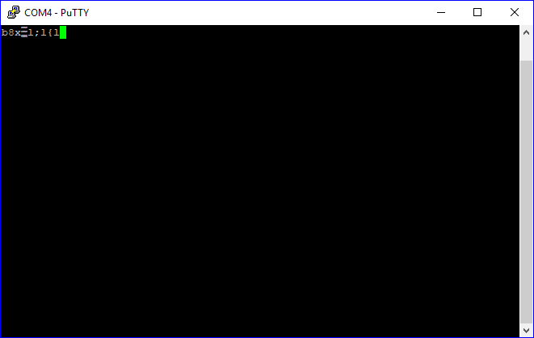
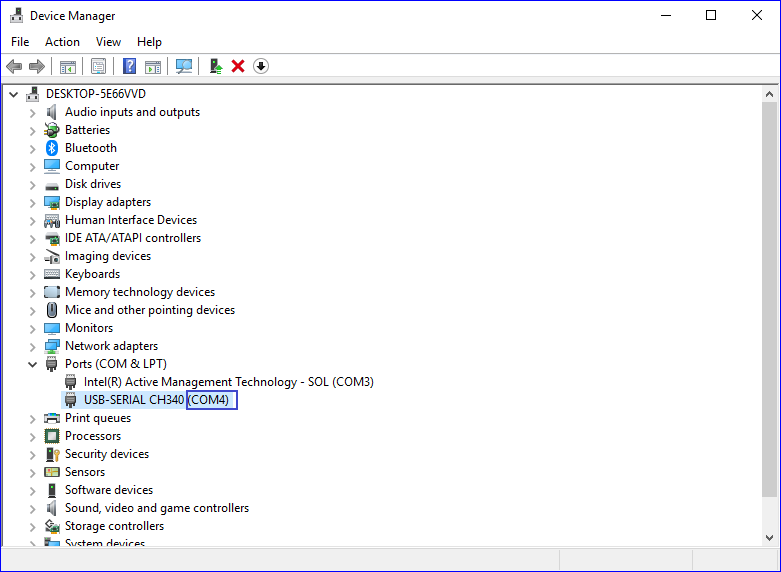

## Instrukcja zestawu deweloperskiego Witty Mini

## Wymagania
Do przygotowania płytki deweloperskiej Witty Mini do pracy pod kontrolą MicroPython potrzebne są następujące komponenty sprzętowe i programowe.
- Komputer PC lub Mac
    - System operacyjny Windows, Linux lub macOS.
    - Zainstalowany interpreter języka Python w wersji 
    2.7 lub 3.4+.
    - Terminal szeregowy np. PuTTY (Windows), picocom (macOS, Linux).
- Zestaw deweloperski Witty Mini.
- Kable micro USB.


## Zestaw deweloperski Witty Mini

![] (img/flashing-instructions/01-board_overview.png)

Zestaw deweloperski składa się z dwóch elementów:

- Płytki Witty Mini z mikrokontrolerem ESP8266 (górna płytka).
- Płytki pomocnicej (dolna część), która zawiera:
    - Przyciski `reset` i `flash`
    - Układ konwertujący TTL -> USB, ułatwiający pracę z konsolą szeregową.


## instalacja esptool.py
esptool.py jest narzędziem napisanym w języku Python służącym do pracy z trybem bootloadera dla układów ESP8266 oraz ESP32.

Jest niezbędne do załadowania firmware'u MicroPython na płytkę deweloperską.

1. Przy pomocy narzędzi `pip` zainstaluj `esptool.py`
```
pip install esptool
```

lub

```
python -m pip install esptool
```

2. Sprawdź czy `esptool.py` działa
    - Wywołaj komendę `esptool.py --help`
    - Efekt działania powinien być podobny do pokazanego poniżej

```
esptool.py v2.5.0
usage: esptool [-h] [--chip {auto,esp8266,esp32}] [--port PORT] [--baud BAUD]
               [--before {default_reset,no_reset,no_reset_no_sync}]
               [--after {hard_reset,soft_reset,no_reset}] [--no-stub]
               [--trace] [--override-vddsdio [{1.8V,1.9V,OFF}]]
               {load_ram,dump_mem,read_mem,write_mem,write_flash,run,image_info,make_image,elf2image,read_mac,chip_id,flash_id,read_flash_status,write_flash_status,read_flash,verify_flash,erase_flash,erase_region,version}
               ...

esptool.py v2.5.0 - ESP8266 ROM Bootloader Utility

positional arguments:
  {load_ram,dump_mem,read_mem,write_mem,write_flash,run,image_info,make_image,elf2image,read_mac,chip_id,flash_id,read_flash_status,write_flash_status,read_flash,verify_flash,erase_flash,erase_region,version}
                        Run esptool {command} -h for additional help
    load_ram            Download an image to RAM and execute
    dump_mem            Dump arbitrary memory to disk
    read_mem            Read arbitrary memory location
[...]
```

## Ściągnięcie firmware'u MicroPython dla ESP8266

1. Wejdź na stronę http://micropython.org/download#esp8266.
2. Pobierz obraz firmware'u MicroPython http://micropython.org/resources/firmware/esp8266-20180511-v1.9.4.bin.
3. Zapisz plik obrazu w znanej lokalizacji.

## Uruchomienie trybu bootloadera

1. Podłącz kabel microUSB do płytki pomocniczej (dolnej)
2. Wciśnij i przytrzymaj przyciski `rst` i `flash`.
3. Zwolnij przycisk `rst` trzymając w dalszym ciągu przycisk `flash`.
4. Zwolnij przycisk `flash`.

**Jeśli w czasie tej operacji uruchomiony był program terminala szeregowego konsola powinna wyglądać podobnie do rysunku poniżej**



5. **UWAGA! Wyłącz program terminala szeregowego jeśli był uruchomiony**


## Podłączenie płytki deweloperskiej i określenie nazwy/ścieżki portu szeregowego

1. Podłącz dolną kabel microUSB do płytki pomocniczej (dolnej), drugi koniec podłącz do komputera.
2. Może być konieczne zainstalowanie dodatkowych sterowników.
3. Jeśli proces podłączania przebiegł pomyślnie w systemie widoczny będzie nowy port szeregowy, służący do komunikacji z zestawem deweloperskim.

### Określenie nazwy/ścieżki portu w systemie operacyjnym
#### Windows
1. Otwórz _Panel Sterownia>System>Menadżer urządzeń_
2. Rozwiń sekcję _Porty (COM i LPT)_
3. Powinien być widoczny nowy port szeregowy, o nazwie podobnej do tej na załączonym rysunku.
    - Nazwa portu w systemie widoczna jest w nawiasie



## Wgranie firmware'u MicroPython na zestaw deweloperski Witty Mini

1. Ściągnij esptool.py.
2. Ściągnij obraz firmware'u MicroPython.
3. Uruchom zestaw deweloperski w trybie bootloadera.
4. Usuń bieżącą zawartość pamięci flash mikrokontrolera ESP8266

```bash
esptool.py --port <port_szeregowy> erase_flash
```
_W miejscu <port_szeregowy> należy wstawić nazwę/ścieżkę portu szeregowego do którego podłączona jest płytka Witty Mini odpowiednią dla używanego systemu operacyjnego_


