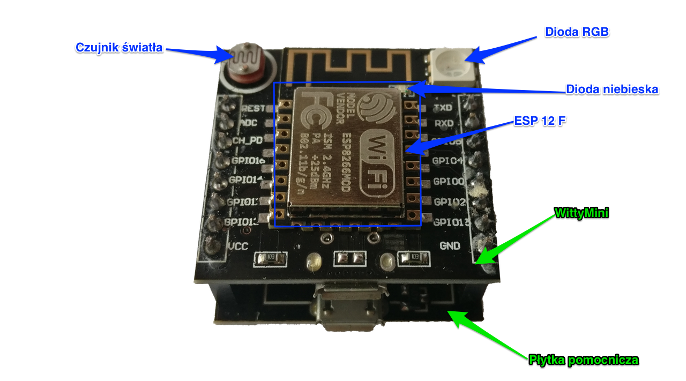
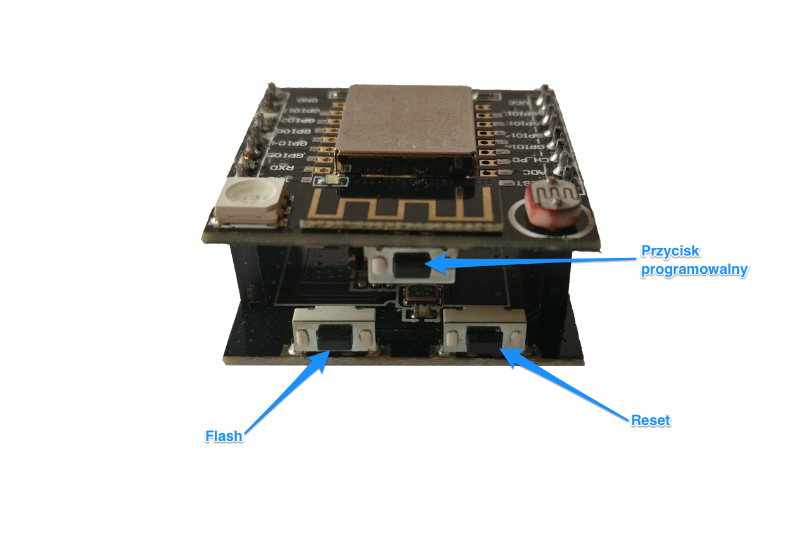
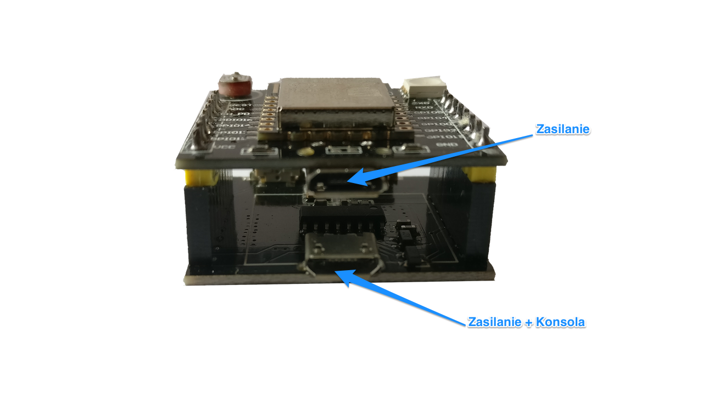

# MicroPython

## MicroPython

- Implementacja języka Python 3.
- Zawiera niewielki podzbiór funkcji bibilioteki standardowej.
- Zoptymalizowana do działania w środowiska o ograniczonych zasobach, takich jak mikrokontrolery.

## MicroPython

- Zawiera zaawansowane mechanizmy takie jak:
    - Interaktywna linia poleceń.
    - Dowolna precyzja liczb całkowitych.
    - Domknięcia, list comprehensions, generatory.
    - Obsługa wyjątków
- Ma niewielkie zużycie pamięci:
    - 256 kB ROM (code).
    - 16 kB RAM.

## MicroPython

- MicroPython dostępny jest dla wielu konfiguracji sprzętowych:
    - `pyboard`
        - Referencyjna płytka deweloperska.
- Oficjalne porty:
    - `WiPy`
        - plafoma sprzętowa oparta od ESP32 stworzona przez PyCom.
    - `ESP8266` 
        - Niskobudżetowy mikroprocesor stworzony przez firmę Espressif Systems.
        - Używany w wielu modułach i zestawach deweloperskich.
    - `ESP32`
        - Następca mikroprocesora ESP8266
    - `unix`
        - Wersja interpretera MicroPython działająca na systemach uniksowych.

# Zestaw deweloperski

## ESP8266

- Procesor wyprodukowany przez Espressif Systems.
- @ 80 MHz
- 32 KiB pamięci RAM na instrukcje.
- 80 KiB pamięci RAM na dane.
- do 16 MiB pamięci flash podłączonej po SPI.
    - Z reguły 512 KiB do 4 MiB.
- We/Wy
    - 16 pinów GPIO
    - SPI (programowo lub sprzętowo)
    - I2C (możliwe programowo)
    - UART + dodatkowy UART tylko do wysyłania danych.
    - 10 bitowy przetwornik AD
- WiFi
    - 802.11 b/g/n.
    - Szyfrowanie WEP, WPA/WPA2.
    - Pracuje jako urządzenie lub Access Point.


## ESP12F

- Moduł oparty o ESP8266.
- Zawiera antenę do WiFi.
- Pamięć Flash 4MB.

## Witty Mini

- Płytka deweloperska oparta o moduł ESP12F.
    - Dodatkowe peryferia:
        - Dioda RGB.
        - Czujnik światła.
        - Przycisk.
        - Regulator napięcia + port mcro USB do zasilania.
- Płytka pomocnicza:
    - Konwerter TTL -> USB (konsola szerwgowa)
    - Przyciski `flash` i `reset` 

## Witty Mini



## Witty Mini



## Witty Mini



# Podłączenie zestawu deweloperskiego

## Terminal szeregowy

- Po podłączeniu kabla microUSB do płytki pomocniczej w systemie operacyjnym widoczny jest nowy port szeregowy.
- należy się do niego podłączyć przy pomocy terminala szeregowego (PuTTY)

## Terminal - Windows


## Terminal - Windows

::: columns

:::: column

::::

:::: column

::::

:::

## Terminal - Linux/Unix/Mac

- Połączenie przy pomocy terminala `picocom`

```
picocom -b 115200 /dev/tty.wchusbserial14150
```

- Opcja `-b` ustawia prędkość połączenia
- `/dev/tty.wchusbserial14150` - ścieżka do portu szeregowego.

## REPL
- Po podłączeniu do terminala pojawia się znak zachęty interpretera Python.
- REPL (Read Eval Print Loop)
    - Pracuje w trybie interaktywnym.
    - Przetwarza komendy języka.
    - Wykonuje je po naciścięciu klawisza `Enter`.
    - Wyświetla wyniki.

## ampy
- Otwarte narzędzie stworzone przez firmę `Adafruit`.
- Wykorzystuje REPL i połączenie szeregowe do obsługi typowych czynności związanych z rozwojem oprogramowania.
- Automatyzuje operacje takie jak:
    - Ładowanie plików na urządzenie.
    - Pobieranie plików z urządzenia.
    - Uruchamianie lokalnych skryptów na urządzeniu.
    - Wyświetlanie listy plików na urządzeniu.
    - Tworzenie i usuwanie katalogów na urządzeniu.

## Konfiguracja WiFi

- Konfiguracja urządzenia jako klienta sieci WiFi

```python
import network

station = network.WLAN(network.STA_IF)
station.active(True)
station.connect('SSID', 'secret_key')
```

- Istnieje także możliwość skonfigurowania ESP8266 w trybie AccessPoint.

## Konfiguracja WiFi

- Wyświetlenie konfiguracji sieciowej.

```python
import network

station = network.WLAN(network.STA_IF)
print(station.ifconfig())
```

# boot.py

## boot.py
- Uruchamia się jako pierwszy przy starcie systemu.
- Powinien zawierać niskopoziomowe komendy inicjalizujące pracę systemu.

## WebREPL
- Pozwala na dostęp do REPL przez WiFi.
- Daje możliwość pobierania i ładowania plików na urządzenie.
- Wymagania:
    - Urządzenie skonfigurowane i podłączone do sieci WiFi.
    - WebREPL włączony na urządzeniu.
    - Pobrany zestaw narzędzi WebREPL.

## Uruchomienie WebREPL

- Połączenie z REPL przez port szeregowy.
- Uruchomienie następujących komend:

```python
>>> import webrepl_setup
WebREPL daemon auto-start status: disabled

Would you like to (E)nable or (D)isable it running on boot?
(Empty line to quit)
> E
To enable WebREPL, you must set password for it
New password (4-9 chars): secret
Confirm password: secret
Changes will be activated after reboot
Would you like to reboot now? (y/n) y
>>>
```

# GPIO

## GPIO

- GPIO - general-purpose input/output. 
- Pin interfejsu do komunikacji między elementami systemu komputerowego.
- Może pracować jako wejście lub wyjście.
    - Często jest to właściwość konfigurowalna.

## GPIO
- Piny GPIO bywają grupowane w porty.
- Często są wyprowadzane w formie wtyczek lub gniazd na płytkach deweloperskich.
- Każdy pin cyfrowy może znajdować się w stanie **wysokim (1)** lub **niskim (0)**.

## GPIO OUTPUT
- Dla pinów wyjściowych mamy możliwość ustawienia ich stanu z poziomu programu.
- MicroPython posiada odpowiednie funkcje w module `machine`.
    - Każdy pin posiada swój numer.
    - Operacje na pinach zaimplementowane są w klasie `machine.Pin`
    - Konstruktor wymaga podania numeru pina i trybu jego pracy.


## GPIO OUTPUT
```python
RED_PIN = 15
red = machine.Pin(RED_PIN, machine.Pin.OUT)
red.on()
red.off()

red.value(1)
red.value(0)
```

## machine.Signal

- W niektórych przypadkach sygnały na pinach mogą dawać odwrotne efekty.
    - Stan niski włącza urządzenie.
    - Stan wysoki wyłącza urządzenie.
- klasa `machine.Signal` dodaje warstwę abstrakcji dla stanu pinów.
    - Daje możliwość odzwierciedlenia stanu urządzenia, a nie pinu.

## machine.Signal

```python
from machine import Pin, Signal

RED_RGB_PIN = 15 # active-high
BLUE_PIN = 2 # active-low

red_pin = Pin(RED_RGB_PIN, Pin.OUT)
blue_pin = Pin(BLUE_PIN, Pin.OUT)
red = Signal(red_pin, invert=False)
blue = Signal(blue_pin, invert=True)

red.value(1)
blue.value(1)

red.on()
blue.on()
```

## GPIO INPUT
- W trybie wejściowym stan pinu jest ustawiany przez urządzenie zewnętrzne.
- Z poziomu programu odczytujemy stan pinu.

## GPIO polling
- Co określony interwał program sprawdza, czy stan uległ zmianie.
- Jeśli zmiana nastąpiła to zostają wykonane odpowiednie akcje.

```python
    import machine

    button = machine.Pin(BUTTON_PIN, machine.Pin.IN)

    while True:
        if not button.value():
            print('Button pressed')
            if pin:
                pin.off()
            pin = next(led_pin)
            pin.on()
```

## Przerwania

- Pojawienie _(ang. interrupt)_ się przerwania powoduje:
    - Przerwanie wykonywanego programu.
    - Skok do procedury obsługi przerwania.
- Po obsłużeniu przerwania następuje powrót do wykonywanego programu.

## Przerwania

- Typy przerwań:
    - Sprzętowe:
        - Zewnętrzne
        - Wewnętrzne
    - Programowe

## Przerwania

- Procedura obsługi przerwania powinna być możliwie krótka.
- Obsługa dużej ilości przerwań naraz ma wpływ na wydajność.

## Obsługa przerwań w MicroPython

```python
led_pins = (red_pin, green_pin, blue_pin)

button = Pin(BUTTON_PIN, Pin.IN)

def toggle_led(pin):
    pins_off(led_pins)
    next(led_pin).on()

button.irq(trigger=Pin.IRQ_FALLING, handler=toggle_led)
```

# PWM

## PWM
- PWM _(ang. Pulse Width Modulation)_.
- Umożliwia smulację wjścia analogowego na cyfrowym pinie.
- Pozwala uzyskać inne wartości niż 0 (stan niski) oraz 1 (stan wysoki).

## PWM - konfiguracja
- PWM jest sterowany dwiema wartościami:
    - częstotliwość _(ang. frequency)_.
    - Współczynnik wypełnienia impulsu _(ang. duty cycle)_.

## PWM w MicroPython
- MicroPython posiada obiekt `machine.PWM`.
    - Przy tworzeniu jako argument przyjmuje utworzony wcześniej obiekt `Pin`
- Metody `.freq()` i `.duty` pozwalają ustawić odpowiednio: częstotliwość oraz współczynnuk wypełnienia.
- Częstotliwoć poawana jest w `Hz` i musi zawierać się w przedziale [1, 1000]
- Współczynnik wypełnienia przyjmuje wartości od 0 (zawsze wyłączony) do 1023 (zawsze włączony.)
- Do wyłączenia trybu PWM służy metoda `deinit`.

## Sterowanie jasnością diody

```python
import machine
import time

BLUE_PIN = 13

blue_led = machine.Pin(BLUE_PIN)
pwm = machine.PWM(blue_led, freq=1000, duty=0)

for x in range(1023):
    pwm.duty(x)
    time.sleep(.01)
pwm.deinit()
```

# Odczyt wartości analogowych

## ADC

- ESP8266 zawiera jeden pin pozwalający na odczyt wartości analogowych.
- Pin jest w stanie obsługiwać napięcia z przedziału od 0V do 1V.
- Jeśli napięcia generowane przez podłączony układ nie mieszczą się w tym przedziale konieczne jest użycie dzielnika napięcia.

## ADC

- MicroPython posiada klasę `machine.ADC` do obsługi konwersji analogo-cyfrowej
- Odczyt następuje przy użyciu metody `.read()`.
- Zwracane są wartości z przedziału od 0 (0V) do 1024 (1V).

## ADC - przykład
```python
import machine

adc = machine.ADC(0)
adc.read()
```

